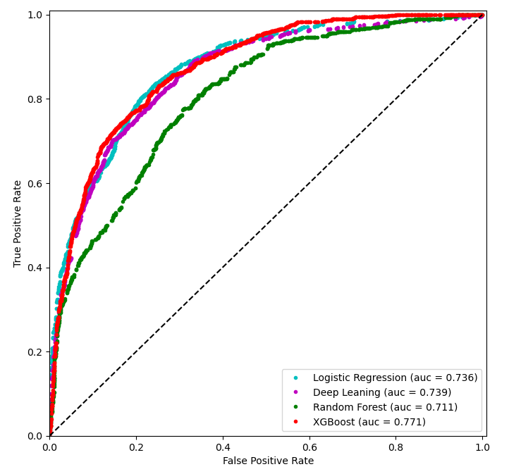

# Predicting of B-cell Epitopes for Vaccine Design

### Contents
The project was carried out in two different jupyter notebooks. The notebook with the title "Grid search" covered detained data cleaning, EDA, and features engineering. The cleaned data were employed in the model building and evaluation to find excellent predictions. The notebook with the title “Summary_results_Project” utilized the best-performed output of the grid research of selected models with an additional explanation of the problem of statement and conclusion. 
This table of content refelect the content of the "Project summary" notebook. 
- 1 Load the Dataset
 * 1.1 Importing Libraries
- 2.0 Features Engineering
- 3.0 Grid Search Results
 * 3.1 XGBoost Grid Rearch Results
 * 3.2 Random Forest Grid Search Results
 * 3.3 Logistic Regression Grid Search Results
 * 3.4 Deep Leaning Grid Search Results
     * 3.4.1 Principal Component Analysis
- 4.0 Comparison of Best Models
 * 4.1 All ROC Curves of the Models
 * 4.2 Prediction on Out of Time Dataset   
- 5.0 Conclusions    
- 6.0 References

### Overview
- The body immunity system protects us against the surrounding pathogenic organisms, such as viruses, bacteria, fungi, and parasites. Out body has special cells of B-cells and T-cells that use to give immediate response towards the recognized pathogens on a spatial protein sequenced receptor region.  These cells form an essential part of our immune system that is capable to provide long-term protection against pathogens(antigens) and harmful molecules using antibodies. 

- Antibodies are protein molecules used routinely for clinical therapeutic, diagnostic, and research purposes due to their unique recognizing and binding sites of antigen. An epitope is a typical location of the proteinaceous structure of the antibody link to the antigen. Understanding the interaction of antibody-antigen at epitope has immense potential for vaccine design, disease prevention, diagnosis, and treatment. The vaccine triggers an immune response, which is without the original activity or harmful impact on the host body with the production of correlated antibodies. The antibodies may be memorized and inherited so that the host body can be protected against the pathogen for a period, or even the whole lifetime from infancy to adulthood under constant investigation and testing.

- Typically, this work focused to address the interaction of severe acute respiratory syndrome (SARS) antigens receptors (epitope) on B-cells surface for production of vaccine.  Accurate knowledge of the binding site of the antibody on its target (epitope) is likely to make the experimental conclusions clearer and relevant towards vaccine development. Machine learning has convenient and cheap tools for feature extraction, feature selection, feature engineering of complex biological, structural, and physicochemical features of antibody-antigen interaction. This approach opens opportunities to extracted genetic information to predict the vaccine candidates against various infectious diseases in the vaccine development pipelines.  Currently, there is great interest in the industries to understand the mechanism of epitopes binding to the antibodies for biologic vaccine development to screen nonredundant candidates. This saves a great deal of money and resources in the process. 

- This study explored the best predictive model/s based on trained biochemical properties of the protein regions of the B-cell epitope with the SARS virus. The models extended to generate the predicted values and probabilities for Covid cells epitope interaction with B-call epitopes to make reality easy for vaccine development.

## Objective of the Project

To explored the optimal predicting model/s based on proteins sequence and physicochemical properties of B-cells epitopes interaction to SARS for the use of vaccine development.

#### Source of Data
- The collected train datasets contain 14387 unique B-cell epitopes and 520 SARS epitopes including the targets value. The test dataset has 20312 observations of different amino acids and peptides sequences together with the physicochemical properties to make binding of antigen-antibody interactions. The data found from Kaggle and IEDB B-cell epitope databases.

The summary of the performace of the models shows below figures at a throshold of recall <= 91% to keep all the positive values as much as possible in the classification.

####  Conclusions

- The models XGBoost, Random Forest, Logistic Regression, and Deep Leaning were selected as per the baseline of model selection and the nature of the datasets. The results were showed that the selected models performed successfully to predict B-cell epitopes in the interaction of the SARS-Covid protein. The recall of the models was kept at 91% to give the greatest attention to all the positive predictions. This threshold is highly required in the vaccine development as much as possible to get the highest positive class. The random forest specifically performed about 90% for 27% positive bassline data. XGBoost also shows very promising results of predicting the epitope interaction about 83%. In the global evolution (AUC) XGBoost performed better about 77% as compared with other models for B-cell epitopes and sars-covid virus interaction. Successfully trained random forest and XGBoost models were used to predict the test data to distinguish pathogenic proteins (Covid virus-cell) from human B-cell antibodies. In addition, the predicted results consist of the perfect experiential conditions with their probabilities of effective interaction in the vaccine development processes. In conclusion, the approaches were used in the project and the findings highlight that the epitopes interaction to the antibodies can be potential vaccine targets against SARS-Covid. The methods used also can be applied for the identification of epitopes interaction from other emerging pathogens to develop potential vaccines against various new strains.

### References used in the project
- Crooke, S. N., Ovsyannikova, I. G., Kennedy, R. B., & Poland, G. A. (2020). Immunoinformatic identification of B cell and T cell epitopes in the SARS-CoV-2 proteome. Scientific reports, 10(1), 1-15.

- Di Natale, C., La Manna, S., De Benedictis, I., Brandi, P., & Marasco, D. (2020). Perspectives in peptide-based vaccination strategies for syndrome coronavirus 2 pandemic. Frontiers in Pharmacology, 11.

- Géron, A. (2019). Hands-on machine learning with Scikit-Learn, Keras, and TensorFlow: Concepts, tools, and techniques to build intelligent systems. O'Reilly Media.

- Kukol, A. (Ed.). (2008). Molecular modeling of proteins (Vol. 443). Totowa, NJ:: Humana Press.

- Sanchez-Trincado, J. L., Gomez-Perosanz, M., & Reche, P. A. (2017). Fundamentals and methods for T-and B-cell epitope prediction. Journal of immunology research, 2017.

- Yang, X., & Yu, X. (2009). An introduction to epitope prediction methods and software. Reviews in medical virology, 19(2), 77-96.
